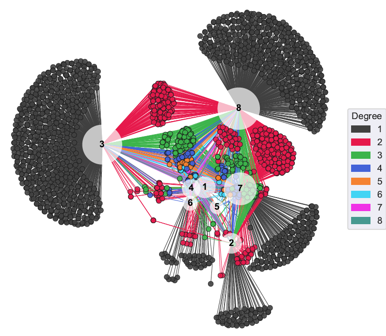
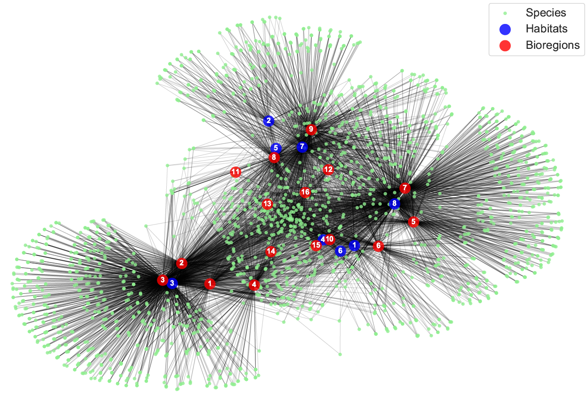
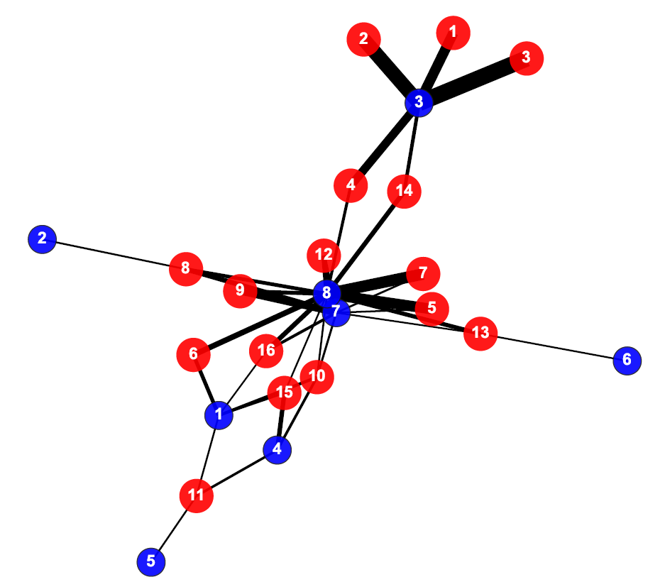

# Antarctica network science project (Dec 2018 - Feb 2020)
This was research assistant work I performed in the Auckland University Physics Department for Te Pūnaha Matatini. I can't share the project report at this point as it is still a work in progress.

As part of this project I spent a lot of time working with the `Python` packages `Numpy`, `Pandas`, and `NetworkX`. I also learnt how to make some neat network visualizations with **Gephi**! The network figures below were produced with NetworkX. [This](https://github.com/HenryAlferink/PORTFOLIO/blob/main/species-habitat-network.png) one was made using Gephi.

---

## Report snippets 

    

**Figure 1.** Bipartite species-habitat network. Numbered nodes are the different habitats; all other nodes are Antarctic species. Colour of the species nodes represents their "degree", that is, the number of habitats those species are found in.

    

**Figure 2.** Tripartite species-habitat-bioregion network. Here we have a tripartite species-habitat-bioregion network, which links species to both the bioregion and habitat in which they are found ("bioregion" is a related concept to "habitat"). This tripartite network was an intermediate step; figure 4 shows the end goal.

    

**Figure 3.** Projection of the previous network: the habitat-bioregion network. If you take the network from figure 3 and remove all the species nodes but leave all the links (there are different ways of doing this), you are left with a projected network. Here we may be seeing some relationships between the different habitats and bioregions based on common species.
