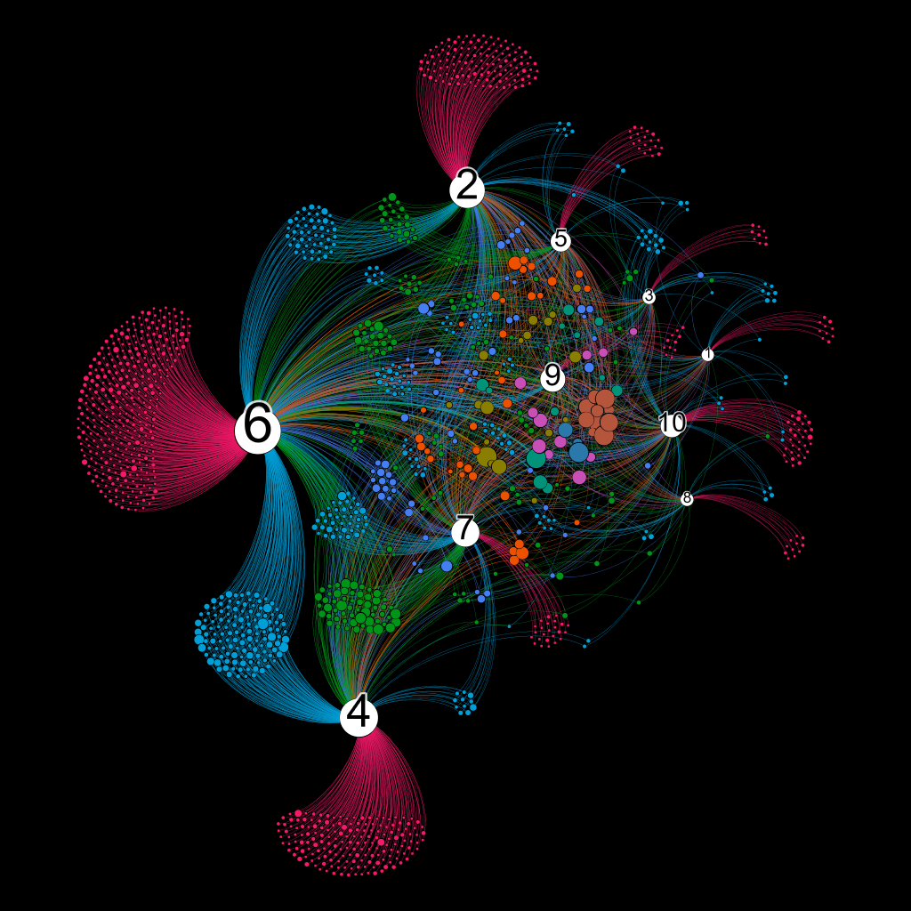

# Project Portfolio
## ToC
1. [**Honours Project**](https://github.com/HenryAlferink/PORTFOLIO/tree/main/Honours_Project). Engineering Science honours project: *data worth analysis for geophysical models*. Folder includes code and reports.
2. [**Canvas Webscraper Project**](https://github.com/HenryAlferink/PORTFOLIO/tree/main/Canvas_Webscraper_Project). Webscraper project for automatically downloading lecture recordings.
    * [SeleniumWrapper](https://github.com/HenryAlferink/PORTFOLIO/tree/main/Canvas_Webscraper_Project/SeleniumWrapper). My custom wrapper for the Python Selenium webdriver package.
3. [**Data Science**](https://github.com/HenryAlferink/PORTFOLIO/tree/main/Data_Science). Some data science projects.
4. [**Antarctica Network Science**](https://github.com/HenryAlferink/PORTFOLIO/tree/main/Antarctica_Network_Science). Summer research project.
5. [**Online Courses**](https://github.com/HenryAlferink/PORTFOLIO/tree/main/Online_Courses). My files resulting from online courses I have done.

## Highlights
### [Interactive Introduction to Bayesian Inverse Problems](https://share.streamlit.io/henryalferink/portfolio/main/Honours_Project/Code/Streamlit_app/Ballistics_Problem_Streamlit.py)
Click on the link to see a primer on Bayesian inverse problems that I made. This was a small part of the work I did in my Engineering Science honours project.

### Antarctica Network Science project
Here is an image of one of the networks I created as part of this project.

**Antarctica species-habitat bipartite network representation produced with Gephi.** *(If I remember correctly:) White nodes are habitats; all other nodes are Antarctic species. Node size represents total number of occurrences of a species node, or the number of species within the habitat if a habitat node. Colour of the species node represents the number of habitats it is found in (can also be seen by looking at the number of links leaving the node).*

